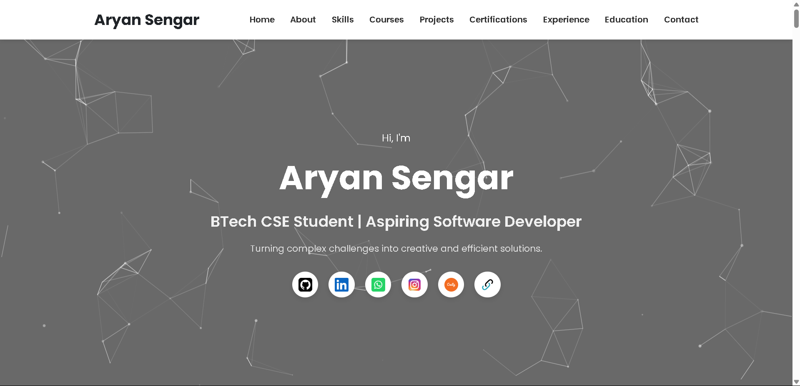

<div align="center">

<!-- ═══════════════════════════════════════════════════════════════ -->
<!--                    ANIMATED WAVE HEADER                       -->
<!-- ═══════════════════════════════════════════════════════════════ -->


<!-- ═══════════════════════════════════════════════════════════════ -->
<!--                   ANIMATED TYPING TAGLINE                     -->
<!-- ═══════════════════════════════════════════════════════════════ -->


<br/>

<!-- ═══════════════════════════════════════════════════════════════ -->
<!--                       CTA BUTTONS                             -->
<!-- ═══════════════════════════════════════════════════════════════ -->

[](https://aryan-sengar-portfolio-v2.netlify.app/)
[](https://drive.google.com/file/d/1vZj_lc41pzM0EAOjB5Hqqdu5jmz5Z91k/view?usp=drive_link)
[](https://drive.google.com/file/d/1XpbRJz0jrJsWMrY0fMZiOj4Tc6CddyE0/view?usp=sharing)

<br/>

<!-- ═══════════════════════════════════════════════════════════════ -->
<!--               ANIMATED SKILL / TECH BADGES                    -->
<!-- ═══════════════════════════════════════════════════════════════ -->


<br/><br/>

[](https://developer.mozilla.org/en-US/docs/Web/HTML)
[](https://developer.mozilla.org/en-US/docs/Web/CSS)
[](https://developer.mozilla.org/en-US/docs/Web/JavaScript)
[](https://www.netlify.com/)
[](https://aryan-sengar-portfolio-v2.netlify.app/)

</div>

<br/>

<!-- ═══════════════════════════════════════════════════════════════ -->
<!--                    ANIMATED WAVE DIVIDER                      -->
<!-- ═══════════════════════════════════════════════════════════════ -->


<!-- ═══════════════════════════════════════════════════════════════ -->
<!--                      PREVIEW SECTION                          -->
<!-- ═══════════════════════════════════════════════════════════════ -->

<div align="center">

[](https://aryan-sengar-portfolio-v2.netlify.app/)

*Click the image to visit the live site ↑*

</div>

<br/>

<!-- WAVE DIVIDER -->


<!-- ═══════════════════════════════════════════════════════════════ -->
<!--                     ABOUT THE PROJECT                         -->
<!-- ═══════════════════════════════════════════════════════════════ -->

## 🧭 About The Project

A **modern, fully responsive** personal portfolio website designed to professionally showcase skills, projects, certifications, and experience. Built from the ground up with pure **HTML, CSS, and JavaScript** — no frameworks, no bloat — just clean, performant code with polished UI animations and interactions.

> 🎯 Designed for recruiters, collaborators, and anyone curious about my work.

<br/>

<!-- WAVE DIVIDER -->


<!-- ═══════════════════════════════════════════════════════════════ -->
<!--                        FEATURES                               -->
<!-- ═══════════════════════════════════════════════════════════════ -->

## ✨ Features

<br/>

| 🎨 UI & Design | ⚙️ Functionality | 📱 Responsiveness |
|:---|:---|:---|
| Animated particle background via **particles.js** | Sticky navigation bar with smooth scrolling | Fully mobile-friendly layout |
| Scroll-triggered animations via **AOS.js** | Preloader on initial page load | Responsive grid & flex layouts |
| 3D tilt effects on cards and icons | Downloadable resume button | Optimized for all screen sizes |
| Clean, modern typography with **Poppins** | Multi-section single-page architecture | Touch-friendly interactive elements |

<br/>

### 📌 Sections Covered

```
About  ·  Skills  ·  Courses  ·  Projects  ·  Certifications  ·  Experience  ·  Education  ·  Contact
```

<br/>

<!-- WAVE DIVIDER -->


<!-- ═══════════════════════════════════════════════════════════════ -->
<!--                       TECH STACK                              -->
<!-- ═══════════════════════════════════════════════════════════════ -->

## 🛠️ Tech Stack

<br/>

<div align="center">

<!-- Animated icon grid -->


<br/><br/>

| Layer | Technology |
|:---:|:---|
| 🏗️ **Structure** | HTML5 — Semantic, accessible markup |
| 🎨 **Styling** | CSS3 — Custom properties, flexbox, grid, animations |
| ⚡ **Interactivity** | Vanilla JavaScript — DOM manipulation, events |
| 🌌 **Background FX** | [particles.js](https://vincentgarreau.com/particles.js/) — Animated particle canvas |
| 🎞️ **Scroll Animations** | [AOS.js](https://michalsnik.github.io/aos/) — Animate On Scroll library |
| 🃏 **Tilt Effects** | [Vanilla Tilt.js](https://micku7zu.github.io/vanilla-tilt.js/) — 3D card tilt interactions |
| 🔤 **Fonts** | [Google Fonts — Poppins](https://fonts.google.com/specimen/Poppins) |
| 🖼️ **Icons** | [Devicon](https://devicon.dev/) & [Simple Icons](https://simpleicons.org/) SVG icon sets |

</div>

<br/>

<!-- WAVE DIVIDER -->


<!-- ═══════════════════════════════════════════════════════════════ -->
<!--                    GETTING STARTED                            -->
<!-- ═══════════════════════════════════════════════════════════════ -->

## 🚀 Getting Started

### Prerequisites

No build tools, no dependencies to install. Just a browser.

### Installation

**1. Clone the repository**

```bash
git clone https://github.com/aryansengar007/my-portfolio-v2.git
```

**2. Navigate to the project folder**

```bash
cd my-portfolio-v2
```

**3. Launch in your browser**

```bash
# Option A — Simply open the file:
open index.html

# Option B — Use VS Code Live Server for hot reload:
# Right-click index.html → "Open with Live Server"
```

> ✅ No npm install. No build step. No configuration needed.

<br/>

<!-- WAVE DIVIDER -->


<!-- ═══════════════════════════════════════════════════════════════ -->
<!--                    PROJECT STRUCTURE                          -->
<!-- ═══════════════════════════════════════════════════════════════ -->

## 📁 Project Structure

```
my-portfolio-v2/
│
├── 📄 index.html                  ← Main HTML entry point
│
└── 📂 assets/
    ├── 📂 css/
    │   └── style.css              ← All styling, animations & layout
    ├── 📂 js/
    │   └── script.js              ← Interactions, AOS init, particles config
    └── 📂 images/
        └── [profile, project & icon images]
```

<br/>

<!-- WAVE DIVIDER -->


<!-- ═══════════════════════════════════════════════════════════════ -->
<!--                     DEMO VIDEO                                -->
<!-- ═══════════════════════════════════════════════════════════════ -->

## 🎥 Project Demo

<div align="center">

The demo walkthrough covers the full portfolio experience — animated hero section, smooth scrolling, interactive project cards, skill showcases, and responsive behavior across devices.

<br/>

[](https://drive.google.com/file/d/1XpbRJz0jrJsWMrY0fMZiOj4Tc6CddyE0/view?usp=sharing)

</div>

<br/>

<!-- WAVE DIVIDER -->


## 👨‍💻 Author

<div align="center">

### Aryan Sengar

🎓 **B.Tech CSE (AI & ML)** @ The NorthCap University &nbsp;|&nbsp; 🌍 Gurgaon, India

<br/>

[](https://www.linkedin.com/in/aryan-sengar-786b96290/)
[](https://github.com/aryansengar007)
[](https://bio.link/aryan_sengar007)
[](mailto:sengararyan997@gmail.com)

</div>

<br/>

<!-- WAVE DIVIDER -->


<!-- ═══════════════════════════════════════════════════════════════ -->
<!--                    ACKNOWLEDGEMENTS                           -->
<!-- ═══════════════════════════════════════════════════════════════ -->

## 🙌 Acknowledgements

- 💡 Inspired by the open-source portfolio community on GitHub
- 🖼️ Icons & logos sourced from [Devicon](https://devicon.dev/) and [Simple Icons](https://simpleicons.org/)
- 🌌 Background particle animation powered by [particles.js](https://vincentgarreau.com/particles.js/)

<br/>

<!-- ═══════════════════════════════════════════════════════════════ -->
<!--                   ANIMATED WAVE FOOTER                        -->
<!-- ═══════════════════════════════════════════════════════════════ -->


<div align="center">

© 2025 **Aryan Sengar** — All Rights Reserved. Unauthorized copying is strictly prohibited.

<br/>

*If you found this project helpful or inspiring, consider leaving a* ⭐ *— it means a lot!*

</div>
