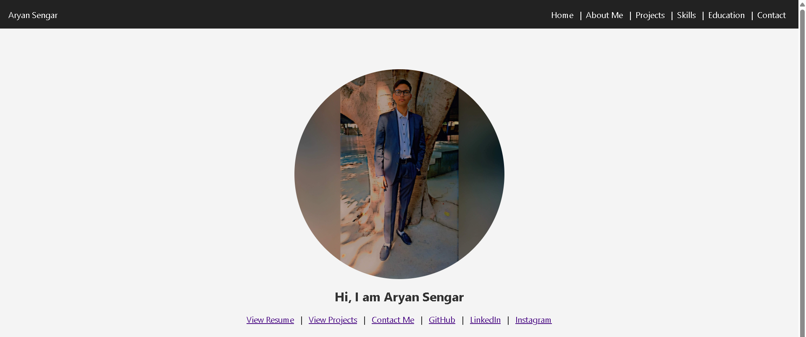

# 🌐 Personal Portfolio Website (v2)

A modern, responsive personal portfolio website built using HTML, CSS, and JavaScript. This project showcases my skills, projects, certifications, and experience — all in a clean, interactive, and professional format.



---

## 🔗 Live Demo

> 🚀 [Coming Soon – Deployed via Netlify or GitHub Pages]

---

## 📌 Features

- 🔹 Responsive, mobile-friendly design
- 🔹 Animated background using **particles.js**
- 🔹 Scroll animations via **AOS.js**
- 🔹 Interactive tilt effects on cards and icons
- 🔹 Preloader and sticky navigation bar
- 🔹 Sections: About, Skills, Courses, Projects, Certifications, Experience, Education, Contact
- 🔹 Downloadable resume link
- 🔹 Clean structure with `index.html`, `style.css`, and `script.js`

---

## 📁 Project Structure

```
my-portfolio-v2/
├── index.html
├── assets/
│   ├── css/
│   │   └── style.css
│   ├── js/
│   │   └── script.js
│   ├── images/
│       └── [All project, profile, and icon images]
```

---

## 🛠️ Tech Stack

- **HTML5**
- **CSS3**
- **JavaScript**
- **AOS (Animate on Scroll)**
- **particles.js**
- **Vanilla Tilt.js**
- **Google Fonts (Poppins)**
- **Devicon & SVG Icons**

---

## 📷 Screenshots

| Hero Section | Skills Grid |
|--------------|-------------|
|  |  |

> _You can add your own screenshots in `assets/images/screenshots/`._

---

## 🚀 Getting Started

1. **Clone the repository**  
   ```bash
   git clone https://github.com/aryansengar007/my-portfolio-v2.git
   ```

2. **Open the project**  
   Just open `index.html` in your browser or use Live Server if using VS Code.

---

## 📄 Resume & Socials

- 📄 [Download My Resume](https://drive.google.com/file/d/1i7ks3CxxfQ-rCn7pj5uBDtQevKBH9hhr/view)
- 🔗 [LinkedIn](https://www.linkedin.com/in/aryan-sengar-786b96290/)
- 💻 [GitHub](https://github.com/aryansengar007)
- 🔗 [Bio Link](https://bio.link/aryan_sengar007)

---

## 👨‍💻 Author

**Aryan Sengar**  
🎓 B.Tech CSE (AI & ML) @ The NorthCap University  
🌍 Gurgaon, India  
📧 aryansengar007@gmail.com

---

## 📃 License

This project is licensed under the [MIT License](LICENSE).

---

## 🙌 Acknowledgements

- Inspired by open-source portfolios on GitHub.
- Icons & logos from [Devicon](https://devicon.dev/) and [Simple Icons](https://simpleicons.org/)
- Background animation from [particles.js](https://vincentgarreau.com/particles.js/)

---

> 💬 *Feel free to fork, contribute, and drop a ⭐ if you find this helpful!*
